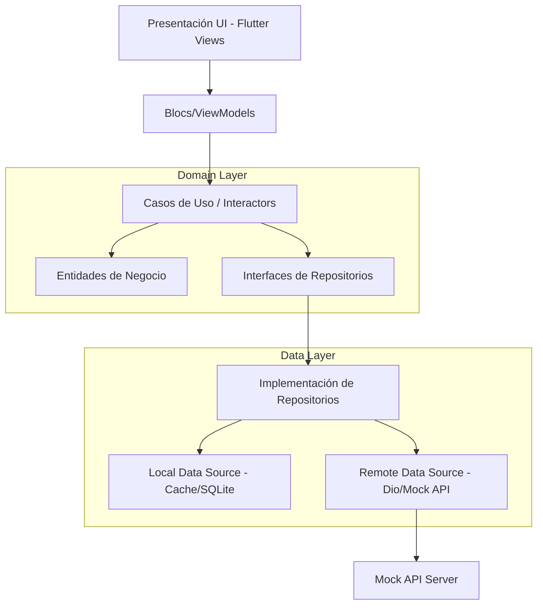

# Diagrama de Arquitectura de BankGo

```mermaid
graph TD
    UI[Presentación UI - Flutter Views] --> VM[Blocs/ViewModels]
    VM --> UC[Casos de Uso / Interactors]

    subgraph Domain Layer
        UC
        ENT[Entidades de Negocio]
        REP_INT[Interfaces de Repositorios]
        UC --> ENT
        UC --> REP_INT
    end

    subgraph Data Layer
        REP[Implementación de Repositorios]
        LDS[Local Data Source - Cache/SQLite]
        RDS[Remote Data Source - Dio/Mock API]
        REP_INT --> REP
        REP --> LDS
        REP --> RDS
    end

    RDS --> API[Mock API Server]
```
