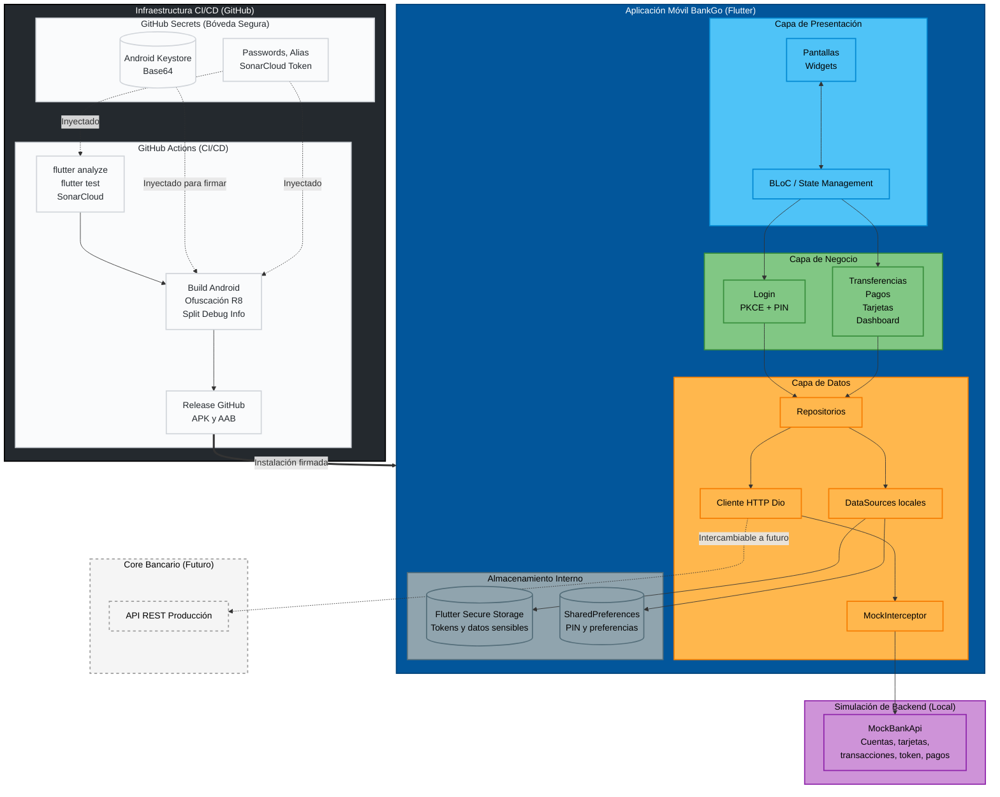

# BankGo

Aplicación móvil bancaria construida con Flutter. El proyecto simula un entorno bancario real con autenticación, dashboard, cuentas, detalle de tarjeta, transferencias, pago de servicios, historial de movimientos, perfil, eventos de simulación y pipeline de release Android ofuscado.

El sistema hoy opera con backend simulado local mediante MockBankApi, interceptación de red con Dio y almacenamiento local para sesión, PIN y preferencias. La estructura está organizada por features, con BLoC para estado, GetIt para inyección de dependencias y separación clara entre presentation, domain y data.

## Estado actual

- Backend actual: simulado localmente.
- Backend productivo: no conectado todavía.
- Arquitectura vigente: feature-first + capas por responsabilidad.
- Flujo de release: GitHub Actions con análisis, tests, SonarCloud, build APK/AAB, ofuscación y firma Android.

## Decisiones técnicas

Por el momento en blanco.

## Arquitectura



## Wireframe

https://balsamiq.cloud/soo4s5t/pxqnl7o/rA310

## Lógica del funcionamiento

### 1. Inicio y bootstrap

- main.dart inicializa formato de fechas, contenedor de dependencias y handlers globales de errores.
- La app levanta AuthBloc y SimulationBloc desde el arranque.
- Se monitorea conectividad para mostrar un indicador visual offline.
- Existe un temporizador de inactividad que redirige al ingreso por PIN.

### 2. Autenticación

- El login usa credenciales demo contra MockBankApi.
- El flujo incluye simulación de PKCE.
- Después del ingreso se puede configurar y reutilizar un PIN local.
- La sesión y datos sensibles se apoyan en almacenamiento local seguro.

### 3. Dashboard

- Muestra saludo contextual, accesos rápidos, cuentas y transacciones recientes.
- El carrusel diferencia cuentas de ahorro/corriente y tarjeta de crédito.
- El dashboard se refresca después de operaciones como transferencias o pagos.

### 4. Mis cuentas y tarjetas

- La pantalla de cuentas presenta las cuentas en formato paginado.
- Cada cuenta muestra movimientos recientes asociados a esa cuenta.
- El detalle de tarjeta concentra acciones sensibles como ver número, expiración y CVV dinámico.
- También permite congelar y activar tarjeta mediante token de seguridad.

### 5. Transferencias

- El usuario valida primero la cuenta destino.
- Luego selecciona cuenta origen y monto.
- Después revisa una pantalla de confirmación.
- Se solicita token y se confirma la transferencia.
- Al finalizar se muestra una pantalla final de Transferencia realizada.

### 6. Pago de servicios

- Existe un flujo dedicado para pago de servicios.
- La simulación contempla validaciones, token y manejo de fallos controlados.

### 7. Historial y perfil

- La app incluye pantalla de transacciones con historial centralizado.
- También incluye perfil de usuario y navegación modular entre pantallas.

## Seguridad

- PKCE simulado en autenticación.
- PIN local para reingreso por inactividad.
- Tokens de seguridad para ver datos sensibles, transferir y congelar o activar tarjeta.
- Flutter Secure Storage para información sensible de sesión.
- SharedPreferences para preferencias y datos no sensibles.
- AppLogger para auditoría técnica y trazabilidad de errores.
- Sanitización de datos sensibles en logs.
- Handlers globales para errores de Flutter y de plataforma.
- Build Android de release con ofuscación, R8 y split debug info.
- Firma Android mediante secretos en GitHub Actions.

## Módulos implementados

- Auth
	Flujo de splash, login, setup de PIN y login por PIN.
- Dashboard
	Resumen principal, carrusel de cuentas, accesos rápidos, notificaciones y transacciones recientes.
- Accounts
	Vista paginada de cuentas, movimientos por cuenta y detalle de tarjeta.
- Transactions
	Historial, transferencias, pagos y pago de servicios.
- Profile
	Pantalla de perfil.
- Core
	Tema, rutas, interceptores, utilidades, errores, mocks y logger.

## Estructura del proyecto

```text
lib/
├── core/
│   ├── constants/
│   ├── errors/
│   ├── mocks/
│   ├── network/
│   ├── routes/
│   ├── theme/
│   ├── utils/
│   └── widgets/
├── features/
│   ├── accounts/
│   ├── auth/
│   ├── dashboard/
│   ├── profile/
│   └── transactions/
├── injection_container.dart
└── main.dart
```

## Stack tecnológico

| Categoría | Herramientas principales |
| --- | --- |
| Framework móvil | Flutter |
| Lenguaje | Dart |
| Estado | flutter_bloc |
| Inyección de dependencias | get_it |
| Cliente HTTP | dio |
| Persistencia local | shared_preferences, flutter_secure_storage |
| Utilidades | equatable, intl, dartz, logger, crypto |
| Conectividad | connectivity_plus |
| UI | google_fonts, shimmer, cached_network_image |
| Testing | flutter_test, bloc_test, mockito |
| Android release | R8, ProGuard, Play Core |
| CI/CD | GitHub Actions, SonarCloud |

## Rutas principales

- /
	Splash.
- /login
	Inicio de sesión.
- /pin-setup
	Configuración de PIN.
- /pin-login
	Reingreso por PIN.
- /dashboard
	Pantalla principal.
- /accounts
	Mis cuentas.
- /transactions
	Historial de movimientos.
- /transfer-wizard
	Flujo guiado de transferencias.
- /service-payment
	Pago de servicios.
- /card-details
	Detalle de tarjeta.
- /profile
	Perfil.

## Configuración y ejecución

### Requisitos

- Flutter SDK compatible con la versión declarada en pubspec.yaml.
- Android Studio o VS Code con soporte Flutter.
- SDK de Android configurado para compilar la app.

### Instalar dependencias

```bash
flutter pub get
```

### Ejecutar en desarrollo

```bash
flutter run
```

### Analizar el proyecto

```bash
flutter analyze
```

### Ejecutar pruebas

```bash
flutter test
```

### Build Android release

```bash
flutter build appbundle --release --obfuscate --split-debug-info=build/symbols
flutter build apk --release --obfuscate --split-debug-info=build/symbols
```

## CI/CD

El workflow de GitHub Actions realiza lo siguiente:

- Checkout del repositorio.
- Configuración de Java 17 y Flutter.
- Instalación de dependencias.
- Preparación del diccionario de ofuscación para Android.
- Ejecución de flutter analyze.
- Ejecución de flutter test.
- Validación y escaneo con SonarCloud en ramas aplicables.
- Build de APK y AAB en release con ofuscación.
- Carga de símbolos de depuración como artifact.
- Creación de tag y GitHub Release.

## Backend simulado

MockBankApi concentra la simulación funcional del sistema. Actualmente maneja:

- Login demo.
- Resumen de cuentas.
- Listado de cuentas.
- Detalle de tarjeta.
- Solicitud y validación de tokens.
- Transferencias entre cuentas mock verificadas.
- Pago de servicios.
- Estado de congelamiento de tarjeta.
- Transacciones recientes y transacciones por cuenta.

## Notas actuales del proyecto

- El backend productivo todavía no está integrado.
- La aplicación está optimizada para demostración funcional y validación de flujos.
- La arquitectura ya contempla el reemplazo gradual del mock por un backend real.
