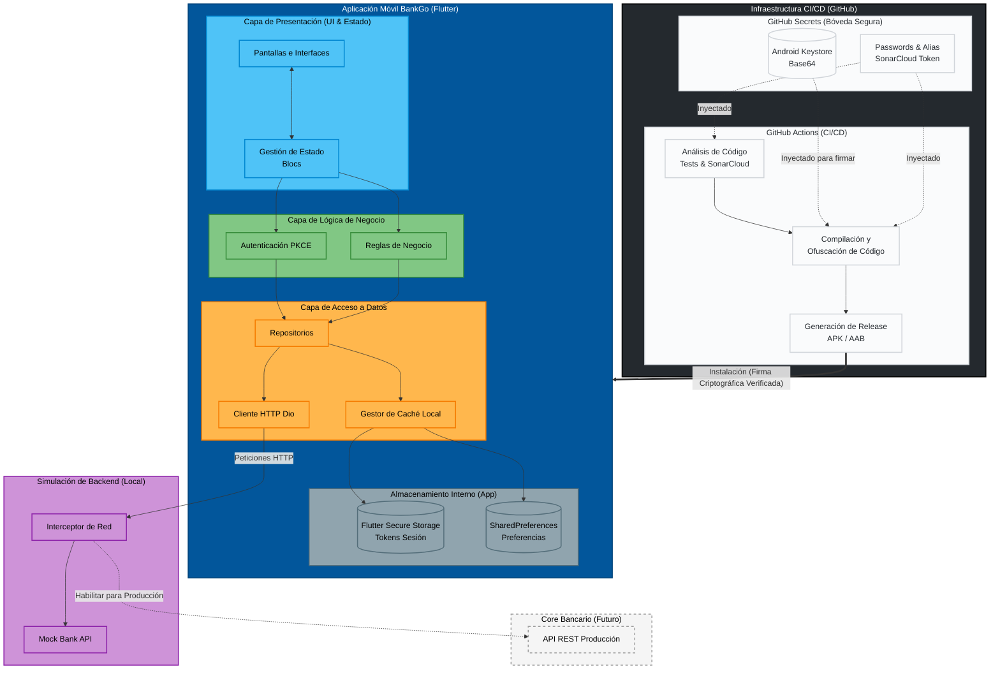

# Arquitectura

Diagrama general de la arquitectura técnica de BankGo, incluyendo aplicación móvil, capas internas, backend simulado, backend futuro y flujo de CI/CD.

## Justificación Arquitectónica

La arquitectura adoptada en BankGo responde a una necesidad clara de equilibrio entre mantenibilidad, seguridad funcional, capacidad de evolución y facilidad de validación durante la etapa actual del proyecto. Dado que el sistema simula una aplicación bancaria con operaciones sensibles, no era suficiente construir una app solo orientada a interfaz; era necesario definir una estructura que separara responsabilidades, redujera acoplamientos y permitiera sustituir componentes sin reescribir todo el sistema.

La decisión de trabajar con una arquitectura por capas y organizada por features se tomó para que cada módulo del sistema pudiera crecer de forma controlada. En una aplicación como BankGo existen flujos con reglas de negocio específicas, como autenticación, visualización de datos sensibles, transferencias, pago de servicios, operaciones con tarjeta y manejo de sesión. Si toda esa lógica permaneciera mezclada en widgets o pantallas, el costo de mantenimiento aumentaría rápidamente y el riesgo de introducir regresiones sería alto. Por eso, la arquitectura actual distribuye las responsabilidades entre presentación, lógica de negocio y acceso a datos.

## Objetivos De La Arquitectura

La arquitectura actual busca cumplir los siguientes objetivos:

- Separar la lógica visual de la lógica de negocio.
- Aislar la fuente de datos para poder reemplazar el backend simulado por uno real en el futuro.
- Permitir pruebas unitarias más simples sobre reglas críticas del sistema.
- Mejorar la trazabilidad de errores y la capacidad de auditoría técnica.
- Sostener flujos bancarios sensibles con un modelo más cercano a un entorno real.
- Facilitar despliegues reproducibles mediante un pipeline controlado en GitHub Actions.

## Por Qué Esta Arquitectura

### 1. Organización Por Features

La organización por features permite agrupar cada módulo funcional de la aplicación según su propósito de negocio y no solo por tipo de archivo. Esto hace que Auth, Accounts, Dashboard, Transactions y Profile puedan evolucionar con mayor independencia.

Esta decisión es especialmente útil en BankGo porque cada feature tiene reglas y estados distintos. Por ejemplo, autenticación maneja credenciales, PIN y sesión; cuentas y tarjetas gestionan datos sensibles; transferencias y pagos operan con validaciones transaccionales. Al mantener cada módulo agrupado, se reduce el riesgo de dependencia accidental entre áreas que deberían evolucionar por separado.

### 2. Separación Por Capas

La separación en presentación, negocio y datos responde al principio de responsabilidad única. Cada capa existe para resolver un problema distinto:

- La capa de presentación se ocupa de mostrar información, escuchar eventos del usuario y reflejar estados.
- La capa de negocio contiene reglas, validaciones y decisiones funcionales del sistema.
- La capa de datos encapsula el acceso a APIs, mocks, almacenamiento local y mapeos.

Esta separación permite que la interfaz no dependa directamente de detalles de infraestructura. En términos prácticos, significa que una pantalla no debería saber si la información proviene de MockBankApi, de un repositorio local o de una API REST real.

### 3. BLoC Como Modelo De Estado

Se optó por BLoC porque la aplicación contiene flujos secuenciales, estados de carga, validaciones y eventos discretos que encajan bien con este modelo. En un contexto bancario, los cambios de estado deben ser predecibles y fáciles de seguir: cuenta validada, token solicitado, operación exitosa, error de seguridad, sesión expirada, tarjeta apagada, entre otros.

El uso de BLoC también favorece las pruebas. Al separar eventos y estados de la UI, es más sencillo validar que una regla de negocio produzca el cambio correcto sin depender del renderizado de widgets.

### 4. Repositorios Como Frontera De Datos

La capa de repositorios fue adoptada para evitar que la presentación o los blocs dependan de implementaciones concretas de datos. Esto es especialmente importante porque el sistema hoy usa un backend simulado local, pero está diseñado para migrar a un backend real.

La existencia de repositorios permite que el mock sea tratado como una implementación más y no como una dependencia transversal de toda la app. Esta decisión reduce deuda técnica futura y permite una migración progresiva sin rehacer completamente la lógica superior.

### 5. Backend Simulado Como Componente Oficial De La Etapa Actual

Se decidió mantener MockBankApi como backend oficial de la fase actual porque el proyecto requiere validar flujos reales antes de integrar servicios externos. Esto permite probar autenticación demo, transacciones, tarjeta apagada, validación de cuentas, movimientos, pagos y errores simulados sin bloquear el avance del producto.

La simulación no se trata como un atajo informal, sino como una pieza controlada del sistema. Por eso existe una capa de acceso, pruebas unitarias y reglas de negocio que interactúan con ella de forma consistente.

### 6. Persistencia Local Diferenciada

La elección de Flutter Secure Storage para datos sensibles y SharedPreferences para configuraciones y preferencias responde a un criterio de seguridad proporcional al tipo de información persistida.

No todos los datos requieren el mismo nivel de protección. Tokens, información sensible de sesión y elementos críticos deben almacenarse en un mecanismo más seguro. En cambio, preferencias o información no sensible pueden mantenerse en una persistencia más ligera. Esta diferenciación evita sobrecostos innecesarios y mejora el diseño de seguridad.

### 7. Pipeline De Entrega Integrado A La Arquitectura

La arquitectura no se limita al código de la app; también incluye la forma en que se valida y distribuye. Por eso el diagrama incorpora GitHub Actions, SonarCloud, firma Android, ofuscación y artefactos release.

La decisión de integrar el pipeline como parte de la arquitectura técnica responde a que, en un sistema con pretensión de calidad bancaria, la forma de construir y publicar también es parte del diseño. No basta con que la app funcione localmente; debe poder analizarse, probarse y generarse de forma repetible y controlada.

## Lectura Del Diagrama

El diagrama representa la arquitectura como un conjunto de capas y entornos relacionados:

- GitHub concentra el proceso de control de calidad, compilación, firma y generación de artefactos.
- La aplicación móvil contiene la interacción del usuario, el estado y la lógica funcional.
- La capa de datos conecta la app con el backend simulado local y deja abierta la transición hacia un backend real.
- El almacenamiento local actúa como soporte para sesión, preferencias y mecanismos de seguridad como PIN o tokens persistidos.
- El backend simulado permite validar el comportamiento actual del sistema sin romper la forma en que luego se integrará el backend productivo.

## Beneficios Esperados

Con esta arquitectura se obtiene lo siguiente:

- Menor acoplamiento entre interfaz, lógica y datos.
- Mayor facilidad para probar reglas de negocio críticas.
- Posibilidad de migrar del mock a producción con menor impacto estructural.
- Mejor trazabilidad de errores, estados y decisiones técnicas.
- Un sistema más sostenible para refactorización futura.
- Mayor alineación entre desarrollo, pruebas y despliegue.

